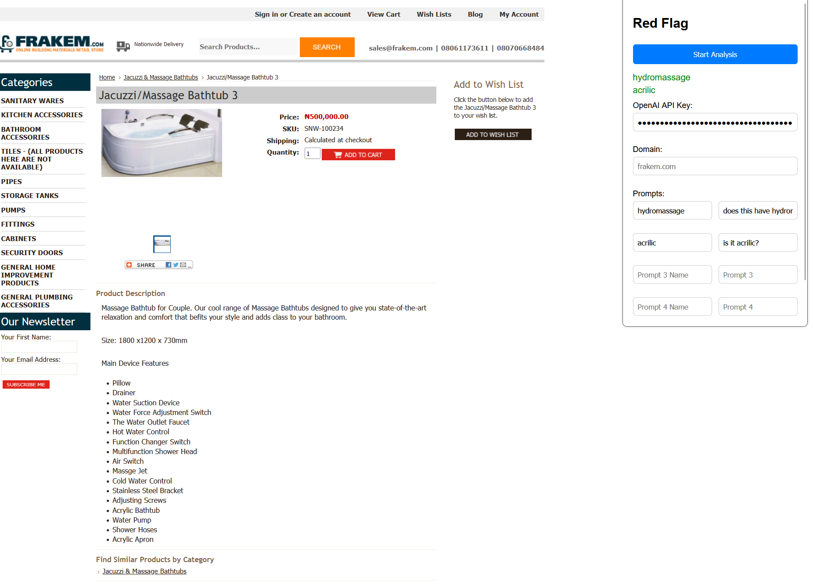

# Red Flag Browser Plugin



## Overview

The **Red Flag Browser Plugin** is a lightweight Firefox extension designed to enhance your web browsing experience by automating the analysis of website content using AI models. It enables users to define custom prompts that evaluate the textual content of any website they visit, helping to identify critical insights or red flags based on predefined criteria.

### Key Features
- **Customizable Prompts**: Users can define up to five custom prompts for each website, specifying what they want the AI to analyze, such as searching as verifying the information.
- **Automated Content Analysis**: Upon visiting a website, users can initiate an analysis where the plugin extracts text and runs it through OpenAI's model, providing clear, color-coded results (green or red) based on the prompts' conditions.
- **Seamless Integration**: The plugin remembers associated prompts for future visits to the same domain and securely stores the user’s OpenAI API key.
- **User-Friendly Interface**: An intuitive interface allows for easy configuration of prompts and one-click analysis, saving prompt changes instantly.

---

## Folder Structure

The project is organized as follows:

├── firefox extension.zip # Packaged Firefox extension for distribution 

└── src/ # Source files for the extension 


## Installation

1. Download or clone the repository:
    ```bash
    git clone https://github.com/your-repo/security-plugin.git
    ```

2. Load the extension into Firefox:
    - Go to `about:debugging#/runtime/this-firefox` in your Firefox browser.
    - Click on **Load Temporary Add-on**.
    - Select the zip folder.
---

## How to Use

1. Install the plugin following the steps in the installation guide.
2. Open the plugin from the browser’s toolbar and enter custom prompts you want to analyze on websites.
3. Visit any webpage and click **Start Analysis**.
4. The plugin will extract and analyze the text on the page based on your predefined prompts.
5. The results will be displayed within the plugin using visual indicators (green for success, red for warnings).

---